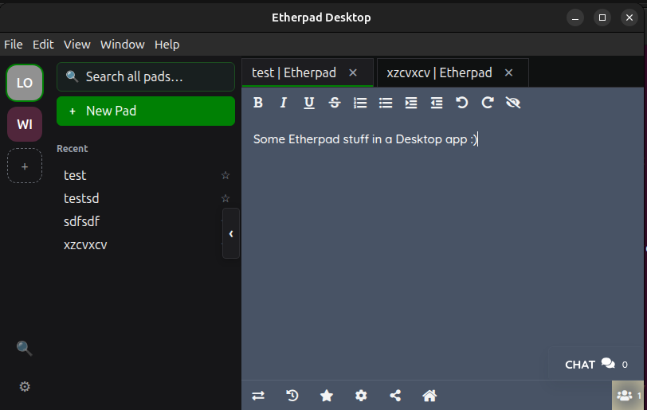

# Etherpad Desktop

Native desktop client for [Etherpad](https://etherpad.org/) — a multi-instance
thin client with per-instance session isolation, a navigable pad sidebar, and
the keyboard shortcuts you'd expect from a modern app.

> [!NOTE]
> **Status: v0 beta.** Linux (AppImage / `.deb` / Snap), Windows (NSIS
> installer / portable `.exe`), and macOS (DMG, arm64 + x64) ship in the
> same beta release. Windows + macOS binaries are currently **unsigned**
> — SmartScreen and Gatekeeper will warn on first run. On Windows click
> "More info" → "Run anyway"; on macOS right-click → Open.



---

## Why use Etherpad Desktop instead of a browser tab?

- **Per-instance isolation.** Each Etherpad server you add gets its own
  session partition (cookies, localStorage, IndexedDB). Your work-pads and
  community-pads stay logged in independently — switching instances never
  signs you out of either.
- **Multi-pad workflow inside one window.** Tabs, like a browser, but only for
  pads. `Ctrl+W` closes a pad without quitting the app.
- **Cross-instance fuzzy search.** Quick switcher (`Ctrl+K` / `Ctrl+F`)
  searches pad names AND pad content across every Etherpad instance at once. Typo-
  tolerant: `monki` finds `monkey`.
- **Stays out of your way.** Minimise to the system tray, focus mode that
  hides the rail and sidebar to give the pad full width, dark/light/auto
  theme that follows your OS.
- **Real auto-update.** AppImage and `.deb` users get electron-updater
  notifications; Snap users get the channel they subscribed to (edge or
  stable).

## Features

### Etherpad instances

- Add multiple Etherpad server URLs as named Etherpad instances, each with its own
  colour and isolated session partition (`persist:ws-<uuid>`).
- Rename, recolour, change the URL, or remove an instance from
  Settings → Etherpad instances. Removing an instance clears its session storage,
  history, and any open tabs.
- Etherpad instances persist across restarts; the rail icons render in the order you
  set.

### Pads

- "+ New Pad" or `Ctrl+T` opens a pad by name. Same name in two instances
  produces two independent tabs.
- Each pad runs in its own native `WebContentsView`, isolated by the
  instance partition. Cookies, localStorage, IndexedDB persist per instance
  — verified by a regression suite (see `tests/e2e/pad-localstorage-persistence.spec.ts`).
- The pad sidebar shows recent pads and lets you pin favourites (★).
- The URL passed to Etherpad includes `?lang=…&userName=…` so the pad UI is
  localised and your name is pre-filled. This is honoured both for newly
  opened pads and for tabs restored after a quit.

### Tabs and keyboard shortcuts

- Tab strip across the top, drag-to-reorder coming.
- `Ctrl+W` close pad. `Ctrl+T` new pad. `Ctrl+,` settings. `Ctrl+R` reload
  the active pad. `Ctrl+Shift+R` reload the shell.
- `Ctrl+K` or `Ctrl+F` opens the quick switcher.
- `Ctrl+1`…`Ctrl+8` jumps to the Nth pad of the active instance.
  `Ctrl+9` jumps to the LAST pad — matches Chrome / Firefox.
- `Esc` closes any open dialog (except the first-run "Add an Etherpad instance"
  modal, which is dismissable=false on purpose).

### Quick switcher

- Searches pad NAMES across all instances and pad CONTENT (downloaded via
  Etherpad's `/p/<name>/export/txt` endpoint and indexed in memory).
- Three matching tiers, in order: direct substring → token-prefix →
  one-edit-distance fuzzy. So `monki` matches `monkey`.
- Arrow keys + Enter to navigate; `Esc` dismisses.

### Settings

- Default zoom, accent colour, theme (light / dark / auto), language
  override, "remember open pads on quit", "minimise to tray", and a
  "Clear all pad history" button.
- Settings → Etherpad instances lets you edit the name, colour (click the swatch),
  and Etherpad URL of each instance inline. The colour picker is the
  swatch itself; URL changes commit on blur or Enter, with inline error
  messaging for invalid URLs.

### Window and tray

- BaseWindow + WebContentsView per pad, repositioned by the main process
  when the rail collapses so "focus mode" actually fills the freed space
  (no black void).
- Window state — bounds, active instance, open tabs — is restored on
  next launch.
- System tray icon (white silhouette of the Etherpad logo) with
  Show / Quit context menu. Closing the last window minimises to tray
  when the setting is on; the tray's Quit really quits.

### Theming and i18n

- Light / dark / auto themes with `prefers-color-scheme` support.
- All user-facing strings go through an i18n proxy (`t.<section>.<key>`)
  with placeholder substitution via `fmt()`. Adding a locale is a matter of
  dropping a new file matching the `Strings` type — the dictionary shape
  is pinned by tests.
- The HTML root's `lang` attribute follows the active language so screen
  readers announce in the right voice.

### Accessibility

- Every dialog uses `role="dialog"` + `aria-modal="true"` +
  `aria-labelledby`, with focus trap + focus restoration on close.
- Buttons across the rail, sidebar, tab strip, and dialogs carry
  `aria-label` and `title`.
- Focus-visible outlines wired on the rail-collapse handle and sidebar
  action buttons.

### Auto-update and packaging

- electron-updater integrated for AppImage + `.deb` (publishes via GitHub
  Releases on tag push).
- Snap publishing wired with a manual gate before stable promotion (the
  snap-publish workflow first ships to `edge` automatically; promotion to
  `stable` is held behind a GitHub Environment with required reviewers).
- `release-please` opens a "release vX.Y.Z" PR on every push to `main`,
  bumping `package.json` + writing `CHANGELOG.md` based on conventional
  commits. Merging that PR creates the tag, which triggers
  `release.yml` + `snap-publish.yml` automatically.

---

## Keyboard shortcuts (cheat-sheet)

| Action | Shortcut |
|---|---|
| New Pad | `Ctrl+T` |
| Close Pad | `Ctrl+W` |
| Reload Pad | `Ctrl+R` |
| Reload Shell | `Ctrl+Shift+R` |
| Settings | `Ctrl+,` |
| Quick Switcher | `Ctrl+K` or `Ctrl+F` |
| Switch to pad N (1-8) | `Ctrl+1` … `Ctrl+8` |
| Switch to last pad | `Ctrl+9` |
| Dismiss dialog | `Esc` |
| Quit | `Ctrl+Q` |

On macOS, swap `Ctrl` for `Cmd`. Both modifiers are accepted globally.

---

## Install

### One-liners

If you just want it running fast, paste the line for your OS. Each one
fetches the *latest release* and runs the installer/AppImage. Manual
download links are in the per-OS sections below.

**Linux (AppImage, no install):**

```bash
curl -fsSL "$(curl -sSL https://api.github.com/repos/ether/etherpad-desktop/releases/latest | jq -r '.assets[] | select(.name | endswith(".AppImage")) | .browser_download_url')" -o ~/etherpad-desktop.AppImage && chmod +x ~/etherpad-desktop.AppImage && ~/etherpad-desktop.AppImage
```

**Linux (deb, system install):**

```bash
F=$(mktemp --suffix=.deb) && curl -fsSL "$(curl -sSL https://api.github.com/repos/ether/etherpad-desktop/releases/latest | jq -r '.assets[] | select(.name | endswith("amd64.deb")) | .browser_download_url')" -o "$F" && sudo apt install -y "$F" && rm "$F"
```

**Linux (snap, once the store listing is public):**

```bash
sudo snap install etherpad-desktop
```

**macOS** (auto-detects Apple Silicon vs Intel):

```bash
A=$([ "$(uname -m)" = arm64 ] && echo arm64 || echo x64) && F=$(mktemp /tmp/epd.XXXXX.dmg) && curl -fsSL "$(curl -sSL https://api.github.com/repos/ether/etherpad-desktop/releases/latest | jq -r --arg a "$A" '.assets[] | select(.name | endswith("-" + $a + ".dmg")) | .browser_download_url')" -o "$F" && open "$F"
```

**Windows (PowerShell, NSIS installer):**

```powershell
$u = (Invoke-RestMethod https://api.github.com/repos/ether/etherpad-desktop/releases/latest).assets | ? { $_.name -like 'Etherpad-Desktop-Setup-*.exe' } | Select -First 1 -ExpandProperty browser_download_url; $f = "$env:TEMP\etherpad-desktop-setup.exe"; Invoke-WebRequest $u -OutFile $f; Start-Process $f
```

> The Linux/macOS one-liners need `jq` (preinstalled on most distros and
> Homebrew). On a stripped-down system: `sudo apt install jq` /
> `brew install jq` first.

---

### Manual download

Download the latest release from
[Releases](https://github.com/ether/etherpad-desktop/releases).

### Linux

#### AppImage (single-file, no install)

```bash
chmod +x Etherpad-Desktop-<version>.AppImage
./Etherpad-Desktop-<version>.AppImage
```

#### `.deb` (Debian / Ubuntu / Mint)

```bash
sudo apt install ./etherpad-desktop_<version>_amd64.deb
etherpad-desktop
```

#### Snap (once on the Snap Store)

```bash
sudo snap install etherpad-desktop
```

The snap auto-updates from the channel you subscribe to (`edge` for nightly,
`stable` for tagged releases).

### Windows

Two flavours, both x64, both **unsigned for v0 beta** (SmartScreen will
warn on first run; click "More info" → "Run anyway"):

- **`Etherpad Desktop-Setup-<version>.exe`** — NSIS installer with
  desktop and Start Menu shortcuts and a proper uninstaller. Default
  install is per-user (no admin needed); the installer offers to change
  the install location.
- **`Etherpad Desktop-<version>-portable.exe`** — single-file portable
  launcher. No install, no shortcuts, no registry writes — useful for
  testers who don't want anything on their machine.

Both binaries auto-update via electron-updater on tagged releases.

### macOS

Two flavours, both **unsigned for v0 beta** (Gatekeeper will block first
launch — right-click → Open the first time, after which subsequent
launches just work):

- **`Etherpad Desktop-<version>-arm64.dmg`** — Apple Silicon (M1/M2/M3/M4).
- **`Etherpad Desktop-<version>-x64.dmg`** — Intel.

Both arches also ship a `*-mac.zip` for electron-updater's delta-update
feed; you don't need to download those manually unless you're scripting
auto-update.

---

## Develop

Requires Node 22+ and `pnpm` 10+ (the version is pinned via `packageManager`
in `package.json`).

```bash
pnpm install
pnpm dev          # run in dev mode (Electron + Vite HMR)
pnpm test         # vitest — unit + component tests
pnpm test:e2e     # Playwright Electron — end-to-end against the in-process
                  # mock Etherpad fixture
pnpm typecheck    # tsc -b across all four leaf tsconfigs
pnpm lint         # ESLint over src + tests
pnpm format       # Prettier write
pnpm package      # build AppImage + deb into release/
```

After main-process source changes, **restart `pnpm dev`** — Vite's HMR only
covers the renderer. Main + preload changes need a full restart.

### How to know what to change where

- **Renderer UI / dialogs / sidebar / tab strip** — `src/renderer/`. HMR
  picks up changes automatically.
- **Main-process windows / tabs / IPC handlers / lifecycle** — `src/main/`.
  Restart `pnpm dev`.
- **Shared types and Zod payload schemas** — `src/shared/`. Both
  processes consume these.
- **Preload bridge (`window.etherpadDesktop` API surface)** —
  `src/preload/index.ts`. Restart `pnpm dev`.

For the full architecture rationale, see
[`docs/superpowers/specs/2026-05-03-etherpad-desktop-linux-mvp-design.md`](docs/superpowers/specs/2026-05-03-etherpad-desktop-linux-mvp-design.md).

For day-to-day AI-pairing guide, see [`AGENTS.md`](AGENTS.md). Claude-specific
notes are in [`CLAUDE.md`](CLAUDE.md).

---

## Roadmap

The current Linux MVP is what's shipped above. The list below is what comes
next, in roughly the order it'll be tackled. Not all of these are committed;
some are signals of intent.

### Soon

- **Permission UX upgrade.** Today the desktop pre-allows the narrow set of
  permissions Etherpad plugins need (camera/mic for `ep_webrtc`, fullscreen,
  clipboard, screen-share). The next iteration will add a deny-by-default
  prompt-on-request flow with persisted decisions per instance+origin so
  untrusted Etherpad URLs are safe to add.
- **Real embedded Etherpad server.** A "Use a local Etherpad server" toggle
  used to live in the Add-Etherpad-instance dialog but was removed because the
  underlying spawn path was broken (`etherpad-lite@latest` doesn't exist on
  npm). The replacement clones `ether/etherpad@vX.Y.Z`, runs `pnpm install`
  + build, and starts via `node`, with a "Manage instance" link that opens
  Etherpad's `/admin` UI in a tab so plugins like `ep_webrtc` can be
  installed there.
- **Tray icon theme adaptation.** White silhouette reads great on dark
  trays but disappears on light ones. Detect `nativeTheme` and ship a
  black-silhouette variant for light trays.
- **Drag-tab-to-reorder** in the tab strip.
- **Drag-tab-to-tear-off** into a new window.

### Code signing — explicit non-goal

We will **never** pay code-signing fees to ship Etherpad Desktop. Apple's
$99/yr Developer ID and Microsoft's EV / Azure Trusted Signing programs
exist to gate independent open-source software behind a recurring tax,
and we're not paying it. Windows users will see the SmartScreen warning
on first run; macOS users will need to right-click → Open the first
time. Both work fine after that.

If a third party (an enterprise, distribution, fork, or anyone else)
wants to **roll out their own signed build** of this codebase, you're
absolutely welcome to. Apache-2.0 lets you do exactly that — clone,
re-brand, sign with your own developer ID, ship it under your own
publisher name. Open-source means the option is there for whoever
values the warning-free first launch enough to fund it themselves.

### Later

- **Offline editing / local pad cache.** When an instance is unreachable,
  open the most recently cached version of pads and queue local edits for
  replay when the server returns.
- **`etherpad-app://` deep-link handler.** Scheme is already registered;
  the handler bodies are stubs. Implementing them gives "open this pad in
  the desktop app" links from a browser.
- **Native OS notifications.** Pad mentions, presence, etc.
- **Self-signed-cert trust UX.** For local Etherpad instances on
  HTTPS-with-self-signed-cert.

---

## Tests

Two layers, both run in CI on every push:

| Layer | Runner | What it covers |
|---|---|---|
| Unit + component | Vitest | Main-process modules (stores, IPC handlers, validation, embedded server, tray, lifecycle). Renderer components (dialogs, rail, sidebar, tab strip) via Testing Library + jsdom. i18n shape contract. |
| End-to-end | Playwright Electron | Full app launches against an in-process mock Etherpad fixture. Instance add/remove, tab open/close/switch, partition isolation, dialog dismissal, focus trap, rail collapse, scroll-with-50-pads, scroll-with-30-workspaces, restore-on-relaunch, pad localStorage persistence, keyboard shortcuts. |

The E2E fixture uses a tiny in-process HTTP server that returns the JSON
shape Etherpad's `/api/` endpoint speaks; tests verify shell behaviour, not
the editor itself. If port 9003 is already serving an Etherpad-shaped
response (e.g. you've got the etherpad snap installed locally), the fixture
will use that as-is instead of binding the port.

---

## License

Apache-2.0. See [`LICENSE`](LICENSE) and [`NOTICE`](NOTICE).

This project is a thin client; the Etherpad server it talks to is upstream
software with its own license and contributors. Etherpad is at
<https://github.com/ether/etherpad>.
